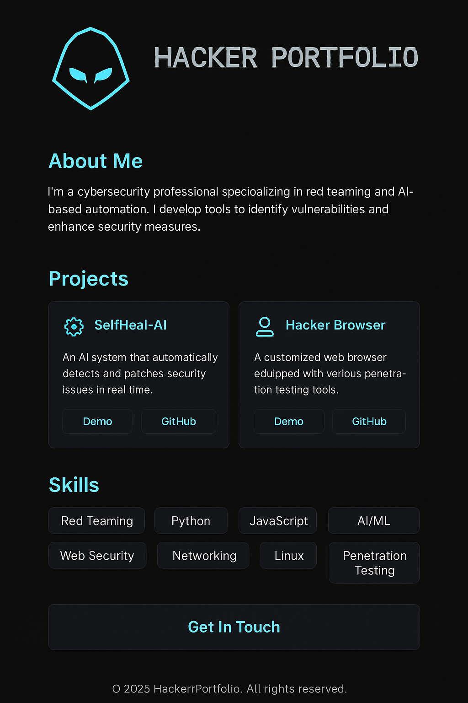

Perfect! Here's a complete README.md for your hacker-themed portfolio project, referencing your image Portfolio.png and describing the purpose, features, and usage.
---

✅ README.md

# ⚔️ Hacker Portfolio - Neon Cyber Themed



## 🚀 Live Demo
> [Add your deployment link here, e.g. GitHub Pages / Vercel / Netlify]

---

## 🧠 About

This is a responsive, hacker-style portfolio built using **HTML**, **TailwindCSS**, and custom dark-neon theme. Designed for cybersecurity professionals, ethical hackers, or red teamers who want to showcase their work with style and clarity.

---

## ✨ Features

- 🧬 Hacker aesthetic (dark mode + glowing cyan colors)
- 🎯 Glitch animation + glass UI
- 🧠 Sections:
  - About Me
  - Projects with GitHub links
  - Skills (Red Teaming, AI, Web Security, etc.)
  - Contact section with CTA button
- 📱 Fully responsive (mobile, tablet, desktop)
- 🖼 Logo integration using your custom image `Portfolio.png`

---

## 🛠 Tech Stack

- HTML5  
- TailwindCSS  
- Google Fonts (Orbitron)  
- Custom CSS animations and glassmorphism  

---

## 📂 Project Structure

. ├── index.html           # Main HTML file (your portfolio) ├── Portfolio.png        # Your portfolio logo/image └── README.md            # This file

---

## 🚧 How to Use

1. Clone the repo:
   ```bash
   git clone https://github.com/your-username/hacker-portfolio.git
2. Add or replace Portfolio.png with your logo.
3. Open index.html in any browser.
4. Deploy to GitHub Pages, Vercel, or Netlify.
5. 
---

📬 Contact

📧 hireme@protonmail.com
🐱 GitHub: [your_username]


---

📜 License

This project is open-source and free to use with credit.
Feel free to fork and customize!

--

> Built in the dark, for the dark. 🔓

